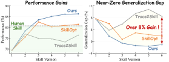
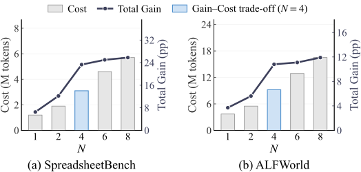

<div align="center">

# Rethinking Self-Evolution: A Constrained Exploration-Exploitation Process for Mitigating Skill Overfitting

### SkillBoost

[](https://arxiv.org/abs/2607.26643)
[](https://www.python.org/)
[](LICENSE)

</div>

---

SkillBoost is a parameter-free framework for continuously improving the external skills used by frozen LLM agents. The paper identifies **skill overfitting** as a central failure mode of trajectory-driven self-evolution: aggressively fitting the current batch improves observed cases but fails to generalize, while unconstrained edits can break behavior that was already stable.

SkillBoost reframes skill evolution as a **constrained search problem** governed by an exploration-exploitation trade-off. Each round localizes failures to editable skill components, explores multiple repair strategies, and commits only candidates that produce verified net improvement under a regression bound.

<p align="center">
  
</p>

## Framework

Given a versioned skill, a frozen agent first performs a forward rollout over a task batch. Backward optimization then applies three stages:

1. **Structured Exploitation** reconstructs failed trajectories, checks workflow compliance, finds the first causal deviation, clusters shared root causes, and maps each cluster to an editable skill component.
2. **Prior-guided Exploration** keeps the evidence-grounded diagnosis fixed while generating multiple candidates under diverse repair strategies, ranging from conservative edits to prior-extended repairs.
3. **Verified Acceptance** evaluates candidate skills and commits only the highest-gain candidate satisfying the anti-regression constraint.

<p align="center">
  
</p>

Candidate quality is measured by its full-set score gain over the incumbent skill, together with the rates of repaired and regressed cases. A candidate is eligible only when it produces a positive net gain and keeps regression below the configured bound. If no candidate passes this gate, the incumbent is retained. Non-update is therefore a valid outcome rather than forcing every round to absorb batch-specific rules.

## Main findings reported in the paper

| Dimension | Result |
|---|---|
| Evaluation scale | 23 model-benchmark configurations spanning single-turn, multimodal, and multi-turn agentic tasks |
| Benchmarks | SpreadsheetBench, BFCL-v4, LiveMathematicianBench, ALFWorld, and DocVQA |
| Baselines | No skill, human-written skill, one-shot LLM skill, Trace2Skill, and SkillOpt |
| Performance consistency | SkillBoost outperforms SkillOpt in all 20 core model-benchmark settings, with a mean gain of 8.97 percentage points |
| Overfitting control | Near-zero train-test gap, while purely trajectory-fitting baselines exhibit consistently negative gaps |
| Transfer | Evolved skills transfer across model families and from LiveMath to OlympiadBench |
| Efficiency | 13.9% fewer inference tokens per case on average than SkillOpt at deployment |

The Best-of-N analysis predicts sublinear, diminishing returns as the candidate pool grows. Experiments confirm that accuracy gains saturate after four candidates, while evaluation cost continues to rise. The paper therefore uses **Best-of-4** with **Top-2 full evaluation** as its default.

<p align="center">
  
</p>

## Repository structure

```text
SkillBoost/
├── skills/evolving_skill/     Generic evaluator → analyzer → mutator workflow
│   ├── skillboost-analyzer/   Structured exploitation and diagnosis
│   ├── skillboost-mutator/    Prior-guided candidate generation
│   └── skillboost-evaluator/  Evaluation evidence and acceptance inputs
├── src/skillboost/            Deterministic contracts and Best-of-N selection
├── schemas/                   Evaluation, repair, and evolution artifacts
├── benchmarks/                Executable task adapters, scorers, and dataset builders
├── examples/seed-skills/      Initial task skills used by evolution runs
├── experiments/               Best-of-N and ablation launchers
├── analysis/                  Paper analysis and plotting utilities
└── tests/                     Offline tests for core invariants
```

The implementation-to-paper mapping is documented in [docs/implementation.md](docs/implementation.md).

## Quick start

The deterministic core requires Python 3.10 or later.

```bash
python3 -m pip install -e .
python3 -m unittest discover -s tests -v
python3 -m skillboost.evolve --help
python3 -m skillboost.orchestrate --help
```

These commands install and validate the deterministic framework; they do **not** execute benchmark cases.

## Run benchmark rollouts

Task execution is implemented by the historical `test_*.py` entry points under [`benchmarks/evaluators/`](benchmarks/evaluators/). They load a frozen task skill, execute and score benchmark cases, and retain the trajectories consumed by the evolution loop.

OpenAI-compatible paths share one environment-only provider configuration. DashScope is selected when `DASHSCOPE_API_KEY` is present:

```bash
export DASHSCOPE_API_KEY="<read from your secret manager>"
# export DASHSCOPE_BASE_URL="<regional OpenAI-compatible base URL>"
```

The same evaluators can use the native Anthropic Messages API through the shared adapter:

```bash
export SKILLBOOST_LLM_PROVIDER=anthropic
export ANTHROPIC_API_KEY="<read from your secret manager>"
export SKILLBOOST_MODEL="<Anthropic model ID>"
# export ANTHROPIC_BASE_URL="https://api.anthropic.com"
```

Other compatible services use `SKILLBOOST_LLM_PROVIDER=openai-compatible`, `LLM_API_KEY`, and `LLM_BASE_URL`. BFCL additionally requires `python3 -m pip install -e '.[bfcl]'`; dataset and environment preparation is summarized in [benchmarks/README.md](benchmarks/README.md).

## Evolve after the baseline run

SkillBoost separates the **frozen task model** from the **evolution model**. The model configured in a benchmark evaluator—such as a DashScope-hosted model—is used only to execute and score task cases. Claude Code, Codex, or another capable agent harness consumes those measured artifacts to perform causal attribution and mutate the external task skill.

```text
frozen task model via benchmark evaluator
  → baseline traces + results + report
evolution model via analyzer + mutator
  → Shared Diagnosis + Repair Briefs + N candidate skill directories
same frozen task model via benchmark evaluator
  → directed screens + Top-K full evaluations
deterministic orchestrator
  → promote the best eligible candidate or retain the incumbent
```

After the baseline evaluator finishes, point `skillboost.evolve` at its report and case-level results. The default runner starts Claude Code in non-interactive mode as the evolution model:

```bash
BASELINE_RUN=outputs/livemath-baseline/train_run_YYYYMMDD_HHMMSS

python3 -m skillboost.evolve \
  --incumbent examples/seed-skills/livemath-solver \
  --baseline-report "${BASELINE_RUN}/evals/report_train_YYYYMMDD_HHMMSS.json" \
  --baseline-results "${BASELINE_RUN}/evals/results_train_YYYYMMDD_HHMMSS.jsonl" \
  --round-id round-1 \
  --round-dir outputs/livemath-round-1 \
  --candidate-count 4
```

This stage invokes `skillboost-analyzer` and `skillboost-mutator`, not the benchmark provider. It writes:

```text
outputs/livemath-round-1/
├── attribution-context.md
├── diagnosis.md
├── diagnosis.json
├── briefs/
│   ├── repair-brief-1.md
│   ├── repair-brief-1.json
│   └── ...
├── candidates/
│   ├── candidate-1/
│   ├── candidate-2/
│   └── ...
├── evolution-prompt.md
├── evolution-model-stream.jsonl
└── round-manifest.json
```

To use an existing Codex or interactive Claude Code session instead, add `--runner prepare-only`. The command prepares the attribution context, candidate copies, and `evolution-prompt.md` without invoking a model. Ask the current agent to execute that prompt, then rerun the same command with `--runner validate-only` to validate every draft Repair Brief and candidate diff.

Finally, use the same evaluator and frozen task-model configuration to screen and fully evaluate the generated candidates. A paper-style Best-of-4/Top-2 selection round is:

```bash
python3 -m skillboost.orchestrate \
  --eval-script benchmarks/evaluators/test_livemath.py \
  --data data/livemath/train.jsonl \
  --baseline-report "${BASELINE_RUN}/evals/report_train_YYYYMMDD_HHMMSS.json" \
  --candidates outputs/livemath-round-1/candidates/candidate-{1,2,3,4} \
  --candidate-brief candidate-1=brief-round-1-1 \
  --candidate-brief candidate-2=brief-round-1-2 \
  --candidate-brief candidate-3=brief-round-1-3 \
  --candidate-brief candidate-4=brief-round-1-4 \
  --topk 2 \
  --metric-key accuracy \
  --metric-direction maximize \
  --max-regression 0.05 \
  --output-base outputs/livemath-round-1/evaluations \
  --promote-to outputs/livemath-solver/v1
```

Benchmark adapters have task-specific dependencies and may require external datasets, execution environments, or model access. See [docs/reproducibility.md](docs/reproducibility.md) before running experiments.

## Core artifacts

SkillBoost keeps the model-mediated decisions inspectable through four explicit artifacts:

- **Evaluation Report** records task performance, completion, correct/incorrect case IDs, slices, and cost.
- **Shared Diagnosis** freezes evidence, causal failure clusters, and the screening set for one round.
- **Repair Brief** pairs that invariant diagnosis with one candidate-specific repair strategy in the paper's eight-module format.
- **Evolution Record** stores candidate reports, acceptance gates, the selected winner, or the reason the incumbent was retained.

Their machine-readable definitions live in [`schemas/`](schemas/).

## Scope

SkillBoost evolves external procedural skills; it does not update model weights. The framework assumes that task outcomes can be scored and that the base model can perform meaningful failure attribution and candidate generation. Weaker attribution or evaluation models can limit the quality of self-evolution.

## Citation

Please use the authoritative BibTeX metadata from the arXiv record linked by the badge at the top of this page.

The vector figures embedded above are derived from the paper's official arXiv source and retain the paper's [CC BY 4.0](https://creativecommons.org/licenses/by/4.0/) attribution terms. See [docs/assets/README.md](docs/assets/README.md).
